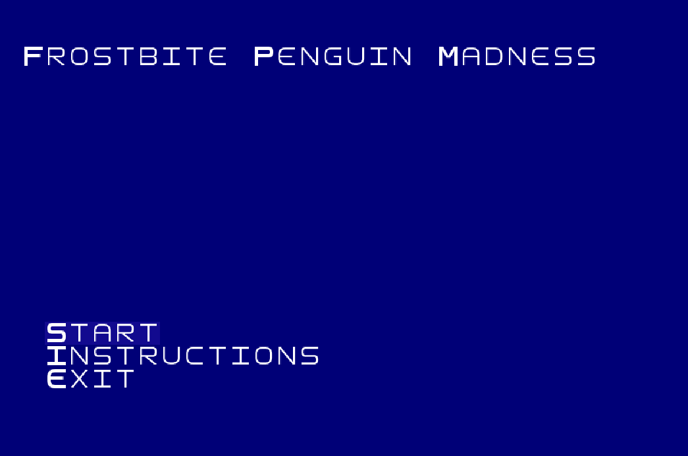
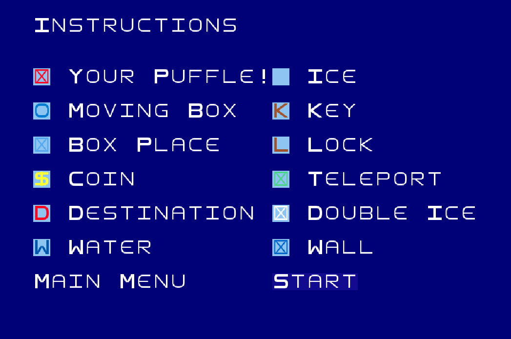
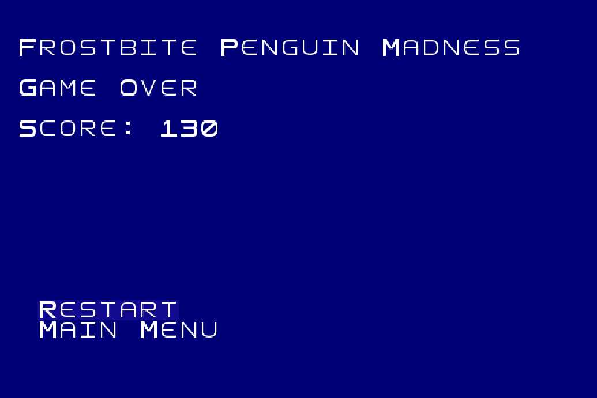
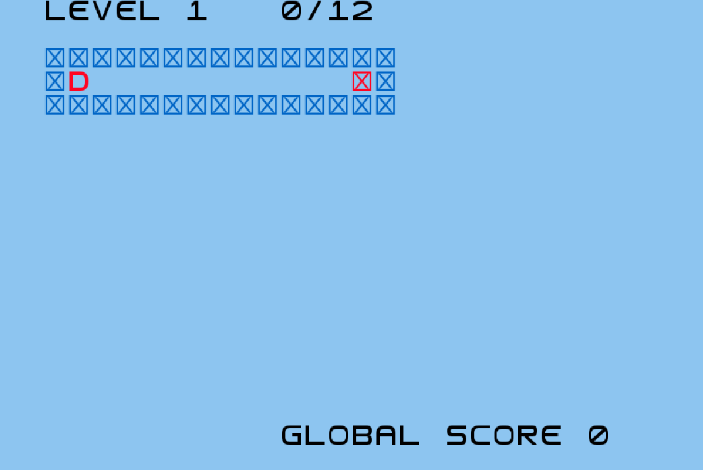
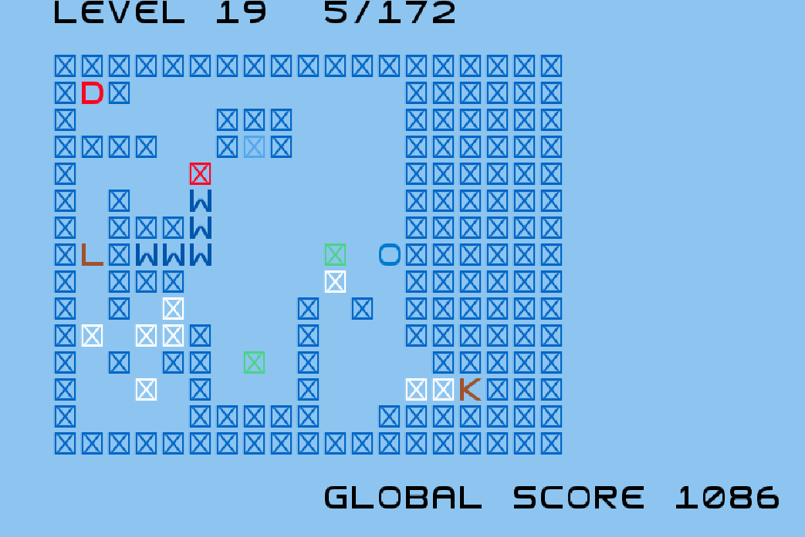
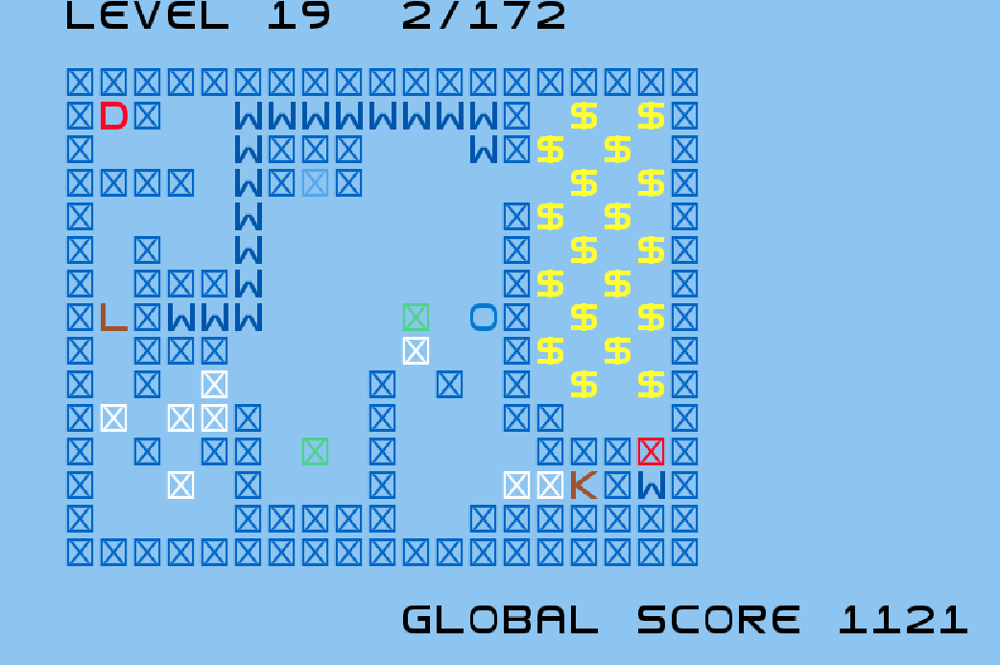

# Frostbite Penguin Madness


O nosso jogo é inspirado num mini-jogo existente no *Club Penguin*, chamado de `Gelo Fino`. O jogador deve controlar um `Puffle`através de inúmeros labirintos, passando pelo maior número de blocos de gelo antes de o completar. Ao longo do jogo vão surgindo moedas coletáveis, blocos de gelo duplo, teletransporte e até passagens secretas, que permitem ao jogador obter uma maior pontuação!

- **Universidade**: [FEUP](https://sigarra.up.pt/feup/pt/web_page.Inicial)
- **Curso**: [MIEIC](https://sigarra.up.pt/feup/pt/cur_geral.cur_view?pv_curso_id=742&pv_ano_lectivo=2019)
- **Unidade Curricular**: [LPOO](https://sigarra.up.pt/feup/pt/UCURR_GERAL.FICHA_UC_VIEW?pv_ocorrencia_id=420000) (Laboratório de Programação Orientada por Objetos)
- **Elementos do Grupo**:    
    - Diogo Samuel Fernandes, up201806250@fe.up.pt
    - Hugo Guimarães, up201806490@fe.up.pt

## Instalação

Para jogar este jogo é necessário correr o projeto utilizando o `Gradlew`, usando o comando
```shell
./gradlew run # se estiver a ser utilizado Linux
./gradlew.bat run # se estiver a ser utilizado Windows
```

## Relatório

O relatório sobre este projeto pode ser lido [aqui](./docs/README.md).


### Screenshots e Gameplay

| Menu         | Instruções | Fim de Jogo |
| ------------ | ---------- | ------------|
|  |  |  |

| Nível 1                       | Nível 19 (Passagem secreta oculta) |  Nível 19 (Passagem secreta descoberta) |
| ----------------------------- | ---------------------------------- | --------------------------------------- |
|   |  |  |

| Gameplay                                   |
| ------------------------------------------ |
||

