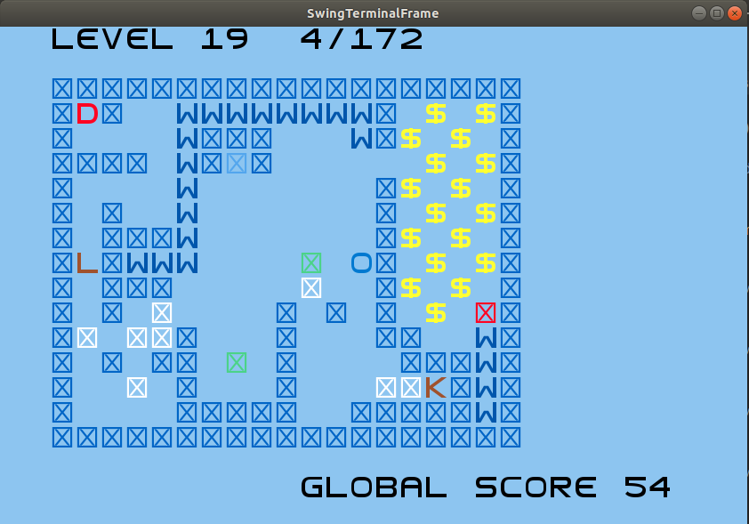
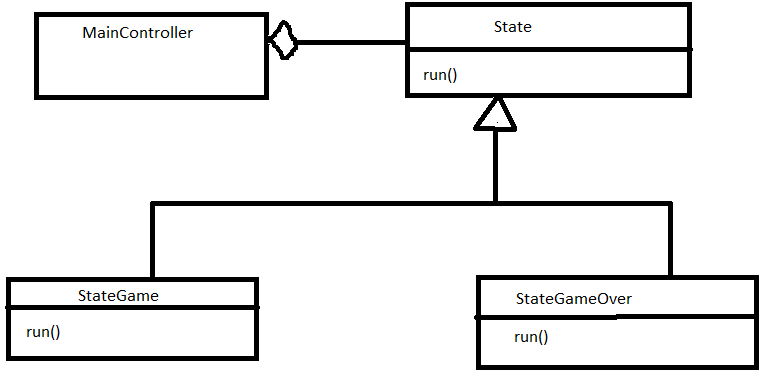
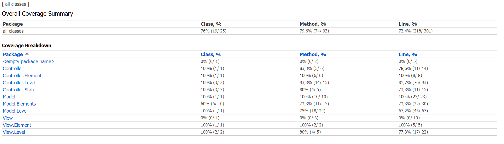

# REPORT - Grupo 70


O nosso jogo é inspirado no jogo `Gelo Fino` que existia no jogo *Club Penguin*. O jogador deve controlar o personagem de jogo através de inúmeros labirintos, passando pelo número máximo de quadrados antes de o completar. Além disso, ao longo do mapa vão surgindo moedas coletaveis que permitem ao jogador obter uma pontuação mais elevada, assim como diversos obstáculos!

- **Universidade**: [FEUP](https://sigarra.up.pt/feup/pt/web_page.Inicial)
- **Curso**: [MIEIC](https://sigarra.up.pt/feup/pt/cur_geral.cur_view?pv_curso_id=742&pv_ano_lectivo=2019)
- **Unidade Curricular**: [LPOO](https://sigarra.up.pt/feup/pt/UCURR_GERAL.FICHA_UC_VIEW?pv_ocorrencia_id=420000) (Laboratório de Programação Orientada por Objetos)
- **Elementos do Grupo**:    
    - Diogo Samuel Fernandes, up201806250@fe.up.pt
    - Hugo Guimarães, up201806490@fe.up.pt

# Indíce

1. [Funcionalidades](#funcionalidades)
2. [Arquitetura do Código](#padrão-arquitetural-do-código)
3. [Design Patterns](#design-patterns)
    - [State](#state)
    - [Command](#state)
4. [Code Smells e Refactoring](#code-smells-e-refactoring)
5. [Unit Tests](#unit-tests)

## Funcionalidades

- [x] Menu Principal
    - [x] Começar um novo jogo
    - [x] Instruções do jogo
    - [ ] Escolha de nível
    - [x] Sair do jogo

- [x] Movimento
    - [x] Sempre que o jogador se movimentar, a sua posição anterior fica inacessível
    - [x] As posições inacessíveis são transformadas em água
    - [x] Quando o jogador não se pode movimentar, isto é, quando rodeado por peças de água e por paredes, perde o jogo

- [ ] Menu Pausa
    - [x] Recomeçar o nível
    - [x] Retornar ao menu principal

- [x] Pontuação
    - [x] Sempre que o jogador percorre um novo quadrado, a sua pontuação incrementa um ponto
    - [x] Existem moedas espalhadas em determinados niveís
    - [x] Capturar uma moeda aumenta a pontuação do jogador em dez pontos

- [x] Mecânicas de jogo
    - [x] Quadrados onde o jogador pode passar por cima duas vezes.
    - [x] Mecanismo chave-fechadura. Só é possível atravessar a fechadura caso se tenha obtido a chave.
    - [x] Quadrados verdes que correspondem a uma zona de teletransporte. Quando o jogador passa por cima do mesmo vai ser teletransportado para outro quadrado verde do mesmo nível.
    - [x] Existência de peças de jogo que são empurradas pelo jogador até colidirem com uma parede. Estas peças podem utilizar os quadardos de teletransporte.
    - [x] Passagens secretas que levem o jogador para zonas bónus com muitos sacos de moedas.

- [x] Menu de fim de jogo
    - [x] O jogo acaba assim que o jogador completar todos os niveis ou perder. É apresentado a pontuação total.
    - [x] Recomeça o jogo
    - [x] Retornar ao Menu Principal

Com o decorrer do projeto poderão ser adicionadas mais funcionalidades




### Drawables

#### Elements
Representam todos os obstáculos possíveis de se encontrar em qualquer nível. Todos ocupam uma só casa, têm a sua respetiva imagem e cor e comportamento que os distingue

- Box - Caixa que pode ser empurrada até colidir com um obstáculo que não possa ser atravessado
- BoxFinalSquare - Posição final onde a *Box* deve ficar, de modo a completar o nível com omaior número de pontos
- Coin - Incrementa os pontos do utilizador por 10 em vez de 1
- Destination - Termina o nível, passando para o seguinte
- Ice - Bloco de gelo que derrete ao interagir com o *Puffle*, tornando-se em *Water*
- InvisibleWall - Tem a imagem de uma parede, mas pode ser atravessado, permitindo desbloquear o nível secreto
- Key - Abre a *Lock*
- Lock - Não pode ser atravessada até encontrar a *Key*
- Puffle - Personagem controlada pelo utilizador
- SecretDestination - Objeto com igual comportamento a *Destination*, que desbloqueia o nível secreto
- Teleport - Está sempre associado a outro *Teleport*. teletransporta o *Puffle* ou a *Box* entre a posição dos 2 *Teleport*, sendo o seu uso bloqueado após a sua utilização por parte do *Puffle*
- ToughIce - Bloco de gelo branco que derrete ao interafir com o *Puffle*, tornando-se em *Ice*
- Wall - Não pode ser atravessada. Representa os limites do nível, mantendo o *Puffle* numa região fechada
- Water - É criada sempre que o *Puffle* atravessa gelo, não podendo ser atravessada. Deste modo, não se podem atravessar 2 blocos de *Ice* mais do que 1 vez

#### LevelHeaders

- CurrentLevel - Indica o atual nível que o Utilizador está a jogar
- GlobalScore - Indica a pontuação total que o Utilizador acumulou até ao momento atual, em todos os níveis que já passou
- LevelBlocks - Indica o número atual e o máximo de blocos atravessados em cada nível

#### Menus

- MenuOtion - Opção de um menu que possa ser selecionada, alterando o estado de jogo
- TextBox - Caixa de Texto de um menu, para imprimir uma string numa certa posição do ecrã


### LevelBuilder

Criamos uma classe levelBuilder para a leitura de um nível através de um ficheiro `.txt`. Estes ficheiros contém os *Elements* de um nível codificados em símbolos ASCII.


### Menu States

Implementamos vários estados associados ao atual menu a ser utilizado


# Padrão Arquitetural do Código

Para a realização deste projeto, decidimos separar e estruturar o nosso código utilizando o MVC. Este modelo foi apresentado durante as aulas e consiste em separar o código em três *packages* diferentes sendo estes:

- O ***Model***, que representa toda a informação presente no jogo
- O ***View***, que é responsável pela visualização do jogo e por enviar a informação recebida do utilizador, como por exemplo, teclas pressionadas no teclado para o *Controller*.
- O ***Controller***, que processa a informação recebida pelo *View* e envia comandos ao *Model* para atualizar o seu estado.


Este padrão arquitetural permite uma maior modularidade ao código, facilitando a implementação de novas funcionalidades.

> Fonte: [Architectural Patterns](https://web.fe.up.pt/~arestivo/presentation/patterns/#56)

# Design Patterns

## Builder
#### Contexto do Problema
Era necessário encontrar uma forma de criar os níveis predefinidos que, sua criação, iriam inicializar diferentes objetos, dependendo do nível, evitando a existência de um construtor enorme responsável por decidir quais objetos a ser criados.

#### Padrão
Para resolver este problema, utilizamos uma adaptação do *Design Pattern* ***Builder***, usando como base o mecanismo de utilização de métodos *Build* para decidir se, em cada nível, iriamos precisar de criar um determinado Element.  

#### Implementação
Ao implementar este *Design Pattern*, apercebemo-nos que a maneira mais simples de construir um nível seria a criação de uma classe única *LevelBuilder*, que iria ser capaz de ler um ficheiro `.txt` e descodificar os simbolos *ASCII*, que estaria associado a um elemento.

##### Diagrama UML
##### Ficheiros
- [LevelBuilder](../src/main/java/org/g70/controller/level/LevelBuilder.java)
- [Resources](../src/main/resources/levelDesign) (This folder contains 19 different levels)

#### Consequências
- Fácil criação de novos níveis.
- Fácil alteraçao dos ficheiros atuais.
- Fácil criação de novos *Elements*.

> Fonte: [Design Patterns - Builder](https://refactoring.guru/design-patterns/builder)

## State
#### Contexto do Problema
Como planeávamos ter um programa que fosse possuir diversos estados de jogo, os quais teriam comportamentos distintos, decidimos que era necessário arranjar um padrão para organizar o código da melhor maneira possível, que permitisse troca entre estados.

#### Padrão
Desta forma, decidimos implementar o *Design Pattern* *State*.

#### Implementação
Decidimos Criar um *MainController* que possuiria uma objeto *State*, e iria estar sempre a executar o método `run()` desse objeto, até que o estado seja alterado pelo controlador.

##### Diagrama UML


##### Ficheiros
- [Main Controller](..src/main/java/org/g70/controller/MainController.java)
- [State](../src/main/java/org/g70/controller/state/State.java)
- [StateGame](../src/main/java/org/g70/controller/state/StateGame.java)
- [StateGameOver](../src/main/java/org/g70/controller/state/StateGameOver.java)
- [StateHelp](..src/main/java/org/g70/controller/state/StateHelp.java)
- [StateMainMenu](../src/main/java/org/g70/controller/state/StateMainMenu.java)

#### Consequências
- Maior modularidade ao código, facilitando não só a alteração dos estados de jogo, mas também a sua adição.

> Fonte: [Design Patterns - State](https://web.fe.up.pt/~arestivo/presentation/patterns/#35)

## Command
### Interações Elemento - Puffle/Box
#### Problema
Sempre que o utilizador pressiona uma tecla para mover a posição do Puffle, vão ser verificadas todas as interações com os diversos Elementos, como por exemplo, se o mesmo passa por cima de uma moeda, se colide com um parede ou outro tipo de bloco especial. A contínua adição de interações entre o objeto e o *Puffle* causou um *Code Smell*, devido ao elevado número de *If Statements* associados a cada interação. Para aleḿ disso, acabamos por adicionar um novo Elemento *Box*, que teria a sua própria interação com cada objeto, o que intensificou o *Code Smell* mencionado.

#### Padrão
Para resolver este problema decidimos utilizar o *Design Pattern Command* que permite encapsular as diferentes interações de cada *Element* com o *Puffle* e a *Box* em diferentes classes.

#### Implementação
Criamos uma classe para cada diferente interação existente, com dois métodos `executePuffle()` e `executeBox()`. De seguida, inicializamos a interação desejada no construtor de cada objeto.  

Sempre que se tenta mover o *Puffle*, é verificada a Interação do elemento que se encontra na nova Posição, sendo chamado o `executePuffle()` da interação. Caso se esteja a calcular o movimento da *Box*, utilizar-se-ia o outro método.

##### Diagrama UML


##### Ficheiros
- [Interact](../src/main/java/org/g70/controller/level/interact/Interact.java)
- [InteractBox](../src/main/java/org/g70/controller/level/interact/InteractBox.java)
- [InteractCoin](../src/main/java/org/g70/controller/level/interact/InteractCoin.java)
- [InteractDestination](../src/main/java/org/g70/controller/level/interact/InteractDestination.java)
- [InteractEmptyBlock](../src/main/java/org/g70/controller/level/interact/InteractEmptyBlock.java)
- [InteractIce](../src/main/java/org/g70/controller/level/interact/InteractIce.java)
- [InteractInvisibleWall](../src/main/java/org/g70/controller/level/interact/InteractInvisibleWall.java)
- [InteractKey](../src/main/java/org/g70/controller/level/interact/InteractKey.java)
- [InteractSecret](../src/main/java/org/g70/controller/level/interact/InteractSecret.java)
- [InteractStop](../src/main/java/org/g70/controller/level/interact/InteractStop.java)
- [InteractTeleport](../src/main/java/org/g70/controller/level/interact/InteractTeleport.java)
- [InteractToughIce](../src/main/java/org/g70/controller/level/interact/InteractToughIce.java)

#### Consequências
- Fácil e rápida implementação do comportamento de novos Elementos
- Evita longos *If Statements* associados ao comportamento de cada Elemento
- Permite evitar código repetido, dado que vários Elementos podem ter a mesma interação (ex: Wall e Water)

### Opções dos menus
#### Problema
Era necessário arranjar uma maneira eficaz de implementar novas opções de cada menu, executando a opção escolhida pelo utilizador, de modo a evitar o *Code Smells* *If Statements*, que estava a surgir graças á variedade de opções associadas a cada menu.

#### Padrão
Para resolver este problema decidimos utilizar o *Design Pattern Command*, que permite encapsular as diferentes opções do jogador nos diferentes menus existentes ao longo do jogo.

#### Implementação
Criamos uma classe para cada opção que o utilizador teria disponível, cada uma a estender a classe abstrata *Option* com um único método *execute()* que
executaria um comando específico. Deste modo, estamos a delegar cada ação existente nos menus a um objeto.

##### Diagrama UML


##### Ficheiros
- [MenuController](../src/main/java/org/g70/controller/menu/MenuController.java)
- [Option](../src/main/java/org/g70/controller/menu/option/Option.java)
- [OptionExit](../src/main/java/org/g70/controller/menu/option/OptionExit.java)
- [OptionHelp](../src/main/java/org/g70/controller/menu/option/OptionHelp.java)
- [OtionMainMenu](../src/main/java/org/g70/controller/menu/option/OptionMainMenu.java)
- [OptionNewGame](../src/main/java/org/g70/controller/menu/option/OptionNewGame.java)

#### Consequências
- Fácil e rápida implementação de novos comandos para os menus presentes no nosso jogo.
- Evita um longo conjunto de *If Statements* associados a cada menu

> Fonte: [Design Patterns - Command](https://web.fe.up.pt/~arestivo/presentation/patterns/#20)


## Facade

### LevelController

#### Problema
A divisão do codigo de acordo com o cumprimento do padrão arquitetural MVC originou uma classe *LevelController* que, ao longo do desenvolvimento do código, se veio a tornar numa classe demasiado longa, responsável por todos os comportamentos associados á lógica do jogo, originando o *Code Smell* *Large Class* e violando o *Single Responsability Principle*


#### Padrão
Para resolver este problema, decidimos usar o *Design Pattern* ***Facade***.
Este padrão permite-nos criar *Facades* responsáveis por novos comportamentos que se vão adicionando ao longo do desenvolvimento.

#### Implementação
Extraimos os métodos associados á manipulação dos *Elements* do *LevelModel*
para uma nova *Facade*.

A nova classe *LevelFacade* é agora responsável pela interação entre os elementos.

Deste modo, o *LevelController* tournou-se numa classe responsável por apenas verificar se o Utilizador perdeu o jogo, deve mudar de nível, ou ganhou pontos, de acordo com as alterações executadas pelo *LevelFacade*.

##### Diagrama UML

##### Ficheiros

- [LevelController](..src/main/java/org/g70/controller/level/LevelController.java)
- [LevelFacade](..src/main/java/org/g70/controller/level/LevelFacade.java)


#### Consequências

- Isolamento do código em classes mais curtas, distribuindo as responsabilidades de cada objeto, corrigindo o *Code Smell* e o principio *SOLID* enunciados.


> Fonte: [Design Patterns - Facade](https://refactoring.guru/design-patterns/facade)

## Strategy

#### Problema
Ao mover o *Puffle* era necessário não só vericar as interações associadas ao bloco para qual o *Puffle* se tenta mover, mas também ao bloco sobre o qual se situa. Inicialmente, para implementarmos este funcionalidade, colocamos vários *if Statements* no método `movePuffle()`, originando os *Code Smells* *Long Method* e *Switch Statements*.

#### Padrão
Para resolvermos este problema, decidimos utilizar o *Design Pattern Strategy*.
Este padrão permite-nos definir uma familia de algoritmos separados em diferentes classes, alterando facilmente o algoritmo que um determinado objeto usa

#### Implementação
Criamos 3 diferentes estratégias: Não fazer nada, adicionar agua e adicionar gelo. Em seguida, no `execute()` de cada *Interact*, executamos a estratégia que estava atualmente em vigor (inicializada a *StrategyRegular*) e demos *set* à estratégia que deve entrar em vigor na próxima interação.

##### Diagrama UML

##### Ficheiros
- [MeltStrategy](../src/main/java/org/g70/controller/level/strategy/MeltStrategy.java)
- [StrategyDoubleIce](../src/main/java/org/g70/controller/level/strategy/StrategyDoubleIce.java)
- [StrategyIce](../src/main/java/org/g70/controller/level/strategy/StrategyIce.java)
- [StrategyNothing](../src/main/java/org/g70/controller/level/strategy/StrategyNothing.java)

#### Consequências
- Implementação da funcionalidade desejada evitando um código desorganizado repleto de *if statements* confusos.
- Fácil alternar entre a estratégia a ser utilizada.
- O controlador deixa de verificar se existe um objeto com uma interação debaixo dele (na mesma posiçao), que maioritariamente nem iria existir, evitando erros e verificações associadas a *null pointers*.
- Fácil adição de novos comportamentos do Puffle ao sair de uma posição.

> Fonte: [Design Patterns - Strategy](https://web.fe.up.pt/~arestivo/presentation/patterns/#30)


## Factory Method
#### Problema
Tinhamo criado Menus e

#### Padrão

#### Implementação
Criamos uma classe *MenuFactory* que recebe várias *Options* e cria um menu com elas. Cada menu pode criar vários tipos de *Options*, nomeadamente *MenuOptions* e *TextBoxes*

##### Diagrama UML

##### Ficheiros

[Drawable](../src/main/java/org/g70/model/drawable/Drawable.java)
[MenuOption](../src/main/java/org/g70/model/drawable/menu/MenuOption.java)
[TextBox](../src/main/java/org/g70/model/drawable/menu/TextBox.java)
[GameOverModel](../src/main/java/org/g70/model/menu/GameOverModel.java)
[HelpModel](../src/main/java/org/g70/model/menu/HelpModel.java)
[MainMenuModel](../src/main/java/org/g70/model/menu/MainMenuModel.java)
[MenuFactory](../src/main/java/org/g70/model/menu/MenuFactory.java)

#### Consequências

- Fácil criação de novos Menus.
- Fácil de adicionar/remover funcionalidades a cada Menu

> Fonte: [Design Patterns - Factory Method](https://web.fe.up.pt/~arestivo/presentation/patterns/#10)

# Code Smells e Refactoring

### Data Class

As classes que se encontram no [*Package Model*](..src/main/java/org/g70/model) são apenas constituídas por atributos, funções *getter* e *setter*.  

Embora se possa resolver este problema colocando alguma *lógica do jogo* nas nossas *Data Classes* utilizando, por exemplo, o *Move Method*, estaríamos a violar o ***MVC***. Sendo assim, podemos afirmar que este *Code Smell* é inerente ao estilo arquitetural utilizado no desenvolvimento do nosso projeto, pelo que não temos planos futuros para o corrigir.

> Fonte: [Data Class](https://refactoring.guru/smells/data-class), [Move Method](https://refactoring.guru/move-method)

### Dead Code e Speculative Generality

Na classe [Level Model](../src/main/java/Model/Level/LevelModel.java), existem *getters* e *setters* que não são utilizados. Estas funções foram utilizadas anteriormente, porém, no processo de *Refactor* ao código, deixaram de ser utilizadas. Para além disso, são funções que podemos utilizar no futuro. Uma vez que estamos perante uma entrega intermédia do projeto, ainda existe bastante código a ser desenvolvido que poderá usufruir da manipulação dos atributos do modelo.  

Este *Code Smell* pode vir a ser problemático, uma vez que  estamos a adicionar linhas de código redundantes, deixando as classes demasiado longas.

O problema pode ser facilmente resolvido eliminando o código inutilizado. Contudo, decidimos não o fazer uma vez que estas linha de código podem vir a ser úteis.

> Fonte : [Dead Code](https://refactoring.guru/smells/dead-code), [Speculative Generality](https://refactoring.guru/smells/speculative-generality)

### Message Chains, Switch Statements e Large Class

A classe [Level Controller](../src/main/java/Controller/Level/LevelController.java) possui um *Code Smell* conhecido como *Message Chain*. Este ocorre quando um objeto invoca um método e esse método invoca outro, continuando este ciclo.

Podemos ver abaixo um exemplo de um método problemático que origina problemas de legibilidade do código.

```java
public void moveHero(Position position) {
    if (!checkCollisions(position)) {
        if(!levelModel.removeWhite(levelModel.getHero().getPosition()))
            levelModel.getFilled().add(new Water(levelModel.getHero().getPosition()));

        if (levelModel.removeCoin(position))
            levelModel.addPoints(10);

        levelModel.addPoints(1);

        if(levelModel.getKey() != null && levelModel.getKey().getPosition().equals(position)){
            levelModel.setKey(null);
            levelModel.setLock(null);
        }
        levelModel.getHero().setPosition(position);
    }
}
```

Além disso, o grande número de *If Statements* existentes no código é em si um *Code Smell* e que neste caso pode ser resolvido utilizando o *Design Pattern Command* como já foi referido acima.

Para resolver este problema podemos seguir os seguintes passos:

- **Extract Method** - Criar novos métodos que executem a manipulação dos atributos do objeto em causa, melhorando a legibilade do código. Neste caso, em vez de `getHero().getPosition()` podiamos utilizar `getHeroPosition()`. No entanto esta solução pode originar um outro *Code Smell* denominado como *Large Class*.

- **Extract Class** - Criar uma nova classe responsável por executar parte do código da classe principal. Combinando este *Refactor* com o anterior, será possível eliminar o *Code Smell* associado a uma *Large Class*.

> Fonte: [Message Chains](https://refactoring.guru/smells/message-chains), [*Couplers*](https://refactoring.guru/refactoring/smells/couplers), [*Extract Method*](https://refactoring.guru/extract-method), [*Extract Class*](https://refactoring.guru/extract-class)

# Unit Tests

Os nossos teste cobrem cerca de 76% do código total. É possível observar a percentagem de testes em cada classe de cada um dos packages principais na seguinte imagem.



Para a criação de testes foram utilizados as frameworks ***JUnit*** e ***Mockito***.

Os resultados dos testes encontram-se na seguinte [pasta](./test).
