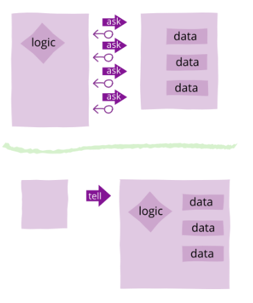
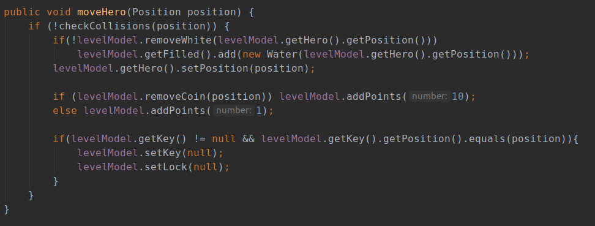

# REPORT - Grupo 70

O nosso jogo é inspirado no jogo `Gelo Fino` que existia no jogo *Club Penguin*. O jogador deve controlar o personagem de jogo através de inúmeros labirintos, passando pelo número máximo de quadrados antes de o completar. Além disso, ao longo do mapa vão surgindo moedas coletaveis que permitem ao jogador obter uma pontuação mais elevada, assim como diversos obstáculos!

- **Universidade**: [FEUP](https://sigarra.up.pt/feup/pt/web_page.Inicial)
- **Curso**: [MIEIC](https://sigarra.up.pt/feup/pt/cur_geral.cur_view?pv_curso_id=742&pv_ano_lectivo=2019)
- **Unidade Curricular**: [LPOO](https://sigarra.up.pt/feup/pt/UCURR_GERAL.FICHA_UC_VIEW?pv_ocorrencia_id=420000) (Laboratório de Programação Orientada por Objetos)
- **Elementos do Grupo**:    
    - Diogo Samuel Fernandes, up201806250@fe.up.pt
    - Hugo Guimarães, up201806490@fe.up.pt

# Indíce

1. [Funcionalidades](#funcionalidades)
2. [Arquitetura do Código](#padrão-arquitetural-do-código)
3. [Design Patterns](#design-patterns)
    - [Strategy](#strategy)
4. [Code Smells e Refactoring](#code-smells-e-refactoring)
5. [Unit Tests](#unit-tests)

# Funcionalidades

- [ ] Menu Principal

- [x] Os quadrados que o jogador percorre ficam inacessíveis
  - [x] Os quadrados inacessíveis estão marcados como sendo água
  - [x] Quando o jogador fica rodeado apenas por água, o mesmo perde
  - [x] Quanto maior for o número de quadrados que o jogador percorre, maior será a sua pontuação

- [x] Existem sacos com moedas espalhados pelo nivel.
  - [x] Capturar um saco com moedas faz aumentar a pontuação do jogador
  - [ ] Podem existir passagem secretas que levem para zonas com muitos sacos de moedas.

- [x] A partir de um certo nivel começa a aparecer gelo mais resistente, isto é uma zona em que o jogador pode passar por cima duas vezes.

- [ ] Os quadrados verdes correspondem a uma zona de teletransporte. Quando o jogador passa por cima do mesmo vai ser teletransportado para outro quadrado verde do mesmo nível.

- [ ] Menu de fim de jogo
    - [ ] O jogo acaba assim que o jogador completar todos os niveis. É apresentado a pontuação total.

Com o decorrer do projeto podemos adicionar mais funcionalidades.

# Padrão Arquitetural do Código

Para a realização deste projeto, decidimos separar e estruturar o nosso código utilizando o MVC. Este modelo foi apresentado durante as aulas e consiste em separar o código em três *packages* diferentes sendo estes:

- Model - Responsável por armazenar a informação do jogo, como a posição dos diversos elementos em cada nível.
- View - Responsável por toda a interação **Utilizador-Máquina**, ou seja, inicializa o Lanterna e atua como a GUI, sendo responsável pelo desenho e envia as ações do utilizador para o **Controller**.
- Controller - é responsável pelo mecanismo do jogo.
Ou seja, o controlador utiliza os dados existentes no **Model** e altera-os garantindo o cumprimento das regras do jogo. Estes dados depois de processados são desenhos no ecrã pelo **View**.

# Design Patterns

### State

#### Contexto do Problema
Como o nosso jogo necessita de ter um main menu, um jogo e um menu de final de jogo decidimos implementar o *Design Pattern* State para controlar esta situação.

#### Padrão
Por este motivo decidimos implementar o *Design Pattern* State para resolver a situação.

#### Implementação

~ Modelo UML

[Main Controller](../src/main/java/Controller/MainController.java)
[State](../src/main/java/Controller/State/State.java)
[StateGame](../src/main/java/Controller/State/StateGame.java)
[StateGameOver](../src/main/java/Controller/State/StateGameOver.java)

#### Consequências
A aplicação deste Design Pattern irá permitir no decorrer do projeto a criação e mais Menus, como por exemplo Menu Inicial, Menu de instruções, entre outros no decorrer do projeto!

// ------------------------------------------------------------------------------
-- TO DO
### Strategy

##### Problema:

Este Método é também capaz de resolver o problema anterior, porém, de uma maneira diferente. Ou seja, divide os tipos de níveis em várias classes derivadas de um nível, sendo cada uma responsável pela execução do percurso da sua forma

##### Exemplo:

Mecanismo chave fechadura: Existência de uma classe **LevelCoin** e outra **LevelKey**. O nosso código seria responsável de chamar um controlador de nivel adequado ao nivel atual. Se Só houvesse coins, chamaríamos o LevelCoin, que não iria verificar as colisões com chave fechadura, gelo branco, etc. Á medida que a complexidade dos níveis iria aumentado, alterávamos o controlador de nivel a utilizar.

### Command

// ------------------------------------------------------------------------------

# Code Smells e Refactoring

Lista de Possíveis Code Smells a mencionar:
1. Bloaters
    1. Long Method (Eu não acho que tenhamos, mas quero o teu feedback e pode ser que o código cresca em algum sítio);

    2. Long Class (Para já acho que não temos nenhuma enorme, mas como disse, o código pode crescer);

2. Object-Orientation Abusers
    1. Switch Statements (De facto temos alguns :-/ )
    2. Temporary Field (Temos várias variáveis (Key and lock) que ora estão null, ora têm um determinado valor)
3. Change Preventers (Não identifiquei grande problema, mas é um Code Smell dificil de se ver, a não ser que queriramos alterar algo) Provavelmente 
4. Dispensables
5. Couplers
6. Other Smells

### Data Class

As classes que se encontram na pasta **Model** são apenas constituídas por *atributos* e funções *get* e *set*.  

Esta situação é problemática, pois viola o princípio **Tell Don't Ask** da **OOP**.

O princípio pode ser facilmente explicado por esta citação de [Martin Fowler](https://martinfowler.com/bliki/TellDontAsk.html).

> Tell-Don't-Ask is a principle that helps people remember that object-orientation is about bundling data with the functions that operate on that data. It reminds us that rather than asking an object for data and acting on that data, we should instead tell an object what to do. This encourages to move behavior into an object to go with the data.

Embora se possa resolver este problema adicionando a lógica do programa às data classes, estaríamos a violar o modelo **MVC**, que requer um **Model** com **Data Classes**. Deste modo, podemos afirmar que este code smell é inerente ao estilo arquitetural que estamos a usar, pelo que não temos planos futuros para o corrigir.

### Dead Code and Speculative Generality

Na classe [Level Model](../src/main/java/Model/Level/LevelModel.java), existem *setters e getters* que não estamos a utilizar, quer por serem funções que utilizamos anteriormente, quer por serem funções que poderemos utilizar no futuro, pois estamos perante uma entrega intermédia do projeto e ainda há muito código por desenvolver que poderá usufruir da manipulação dos atributos do modelo.  

Este code smell é problemático, porque estamos a adicionar linhas de código redundantes cujo único propósito atual é complicar o código.  

Este problema pode ser facilmente resolvido eliminando o **Dead Code**. Contudo, decidimos não o fazer porque, como mencionado anteriormente, estas linha de código podem ser úteis no futuro (*Speculative Generality*)

### Message Chains and Inappropriate Intimacy

A classe [Level Controller](../src/main/java/Controller/Level/LevelController.java) incorre no Code Smell **Message Chains**, havendo linhas de código com acesso a Métodos de um objeto do objeto da classe.
eg: 

Este método é problemático, pois dificulta a leitura do código e implica o uso constante de métodos e atributos pertencentes a outras classes (**Feature Envy** and **Inappropriate Intimacy**)

# Unit Tests
