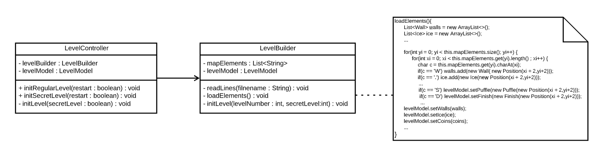
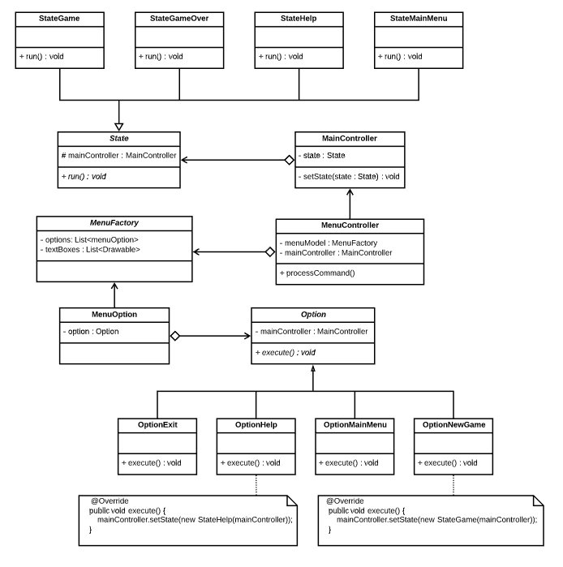
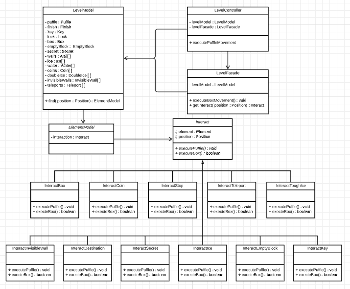
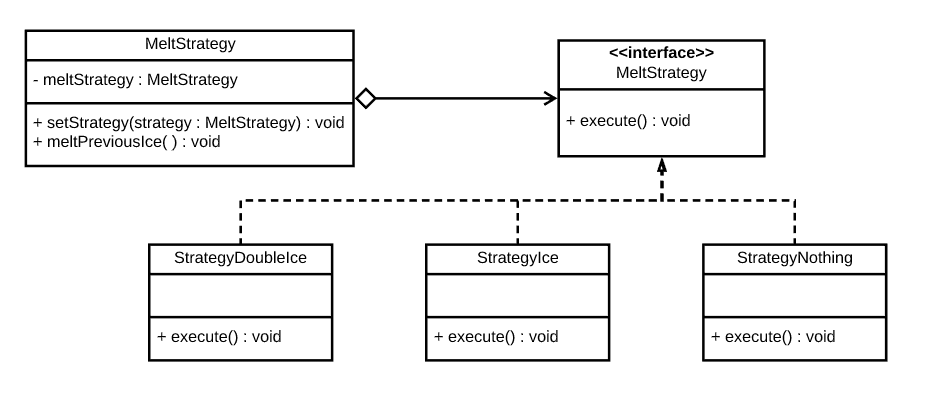
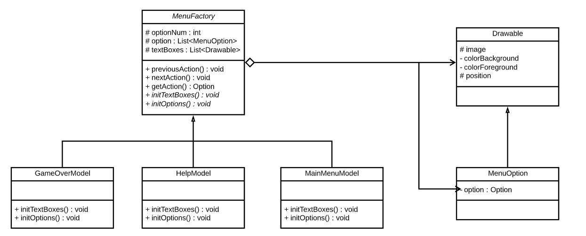
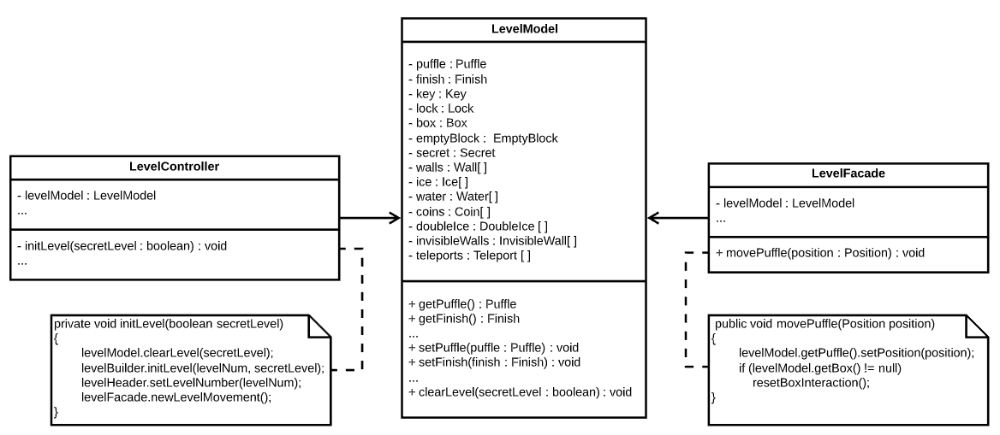

# REPORT - Grupo 70

O nosso jogo é inspirado no jogo `Gelo Fino` que existia no jogo *Club Penguin*. O jogador deve controlar o personagem de jogo através de inúmeros labirintos, passando pelo número máximo de quadrados antes de o completar. Além disso, ao longo do mapa vão surgindo moedas coletaveis que permitem ao jogador obter uma pontuação mais elevada, assim como diversos obstáculos!

- **Universidade**: [FEUP](https://sigarra.up.pt/feup/pt/web_page.Inicial)
- **Curso**: [MIEIC](https://sigarra.up.pt/feup/pt/cur_geral.cur_view?pv_curso_id=742&pv_ano_lectivo=2019)
- **Unidade Curricular**: [LPOO](https://sigarra.up.pt/feup/pt/UCURR_GERAL.FICHA_UC_VIEW?pv_ocorrencia_id=420000) (Laboratório de Programação Orientada por Objetos)
- **Elementos do Grupo**:    
    - Diogo Samuel Fernandes, up201806250@fe.up.pt
    - Hugo Guimarães, up201806490@fe.up.pt

# Indíce

1. [Funcionalidades Implementadas](#funcionalidades-implementadas)
2. [Funcionalidades Planeadas](#funcionalidades-planeadas)
3. [Design](#design)
    - [MVC](#padrao-arquitetural-do-codigo)
    - [Level Builder](#level-builder)
    - [MenuState with Command](#menustate-with-command)
    - [Puffle/Box Movement Strategy](#pufflebox-movement-strategy)
    - [Melting Strategy](#melting-strategy)
    - [Menu Factory](#menu-factory)
    - [Private Class Data on LevelModel](#private-class-data-on-levelmodel)
4. [Code Smells e Refactoring](#code-smells-e-refactoring)
    - [Data Class](#data-class)
    - [Large Class](#large-class)
5. [Unit Tests](#unit-tests)

## Funcionalidades Implementadas

### Drawables

#### Elements
Representam todos os obstáculos possíveis de se encontrar em qualquer nível. Todos ocupam uma só casa, têm a sua respetiva imagem e cor e comportamento que os distingue

##### Movable
Alguns *Elements* são capazes de se movimentar

- Box - Caixa que pode ser empurrada até colidir com um obstáculo que não possa ser atravessado
- Puffle - Personagem controlada pelo utilizador

##### Imovable
Os restantes *Elements* não são capazes de se movimetnar

- Coin - Incrementa os pontos do utilizador por 10 em vez de 1
- DoubleIce - Bloco de gelo branco que derrete ao interafir com o *Puffle*, tornando-se em *Ice*
- EmptyBlock - Posição final onde a *Box* deve ficar, de modo a completar o nível com omaior número de pontos
- Finish - Termina o nível, passando para o seguinte
- Ice - Bloco de gelo que derrete ao interagir com o *Puffle*, tornando-se em *Water*
- InvisibleWall - Tem a imagem de uma parede, mas pode ser atravessado, permitindo desbloquear o nível secreto
- Key - Abre a *Lock*
- Lock - Não pode ser atravessada até encontrar a *Key*
- Secret - Objeto com igual comportamento a *Destination*, que desbloqueia o nível secreto
- Teleport - Está sempre associado a outro *Teleport*. teletransporta o *Puffle* ou a *Box* entre a posição dos 2 *Teleport*, sendo o seu uso bloqueado após a sua utilização por parte do *Puffle*
- Wall - Não pode ser atravessada. Representa os limites do nível, mantendo o *Puffle* numa região fechada
- Water - É criada sempre que o *Puffle* atravessa gelo, não podendo ser atravessada. Deste modo, não se podem atravessar 2 blocos de *Ice* mais do que 1 vez

#### LevelDrawable
- CurrentLevel - Indica o atual nível que o Utilizador está a jogar
- GlobalScore - Indica a pontuação total que o Utilizador acumulou até ao momento atual, em todos os níveis que já passou
- LevelBlocks - Indica o número atual e o máximo de blocos atravessados em cada nível

#### MenuDrawable
- MenuOption - Opção de um menu que possa ser selecionada, alterando o estado de jogo

### LevelBuilder
Criamos uma classe levelBuilder para a leitura de um nível através de um ficheiro `.txt`. Estes ficheiros contém os *Elements* de um nível codificados em símbolos ASCII.

### Menu
Implementamos vários estados associados ao atual menu a ser utilizado

# Funcionalidades Planeadas

- [x] Menu Principal
    - [x] Começar um novo jogo
    - [x] Instruções do jogo
    - [ ] Escolha de nível
    - [x] Sair do jogo

- [x] Movimento
    - [x] Sempre que o jogador se movimentar, a sua posição anterior fica inacessível
    - [x] As posições inacessíveis são transformadas em água
    - [x] Quando o jogador não se pode movimentar, isto é, quando rodeado por peças de água e por paredes, perde o jogo

- [ ] Menu Pausa
    - [x] Recomeçar o nível
    - [x] Retornar ao menu principal

- [x] Pontuação
    - [x] Sempre que o jogador percorre um novo quadrado, a sua pontuação incrementa um ponto
    - [x] Existem moedas espalhadas em determinados niveís
    - [x] Capturar uma moeda aumenta a pontuação do jogador em dez pontos

- [x] Mecânicas de jogo
    - [x] Quadrados onde o jogador pode passar por cima duas vezes.
    - [x] Mecanismo chave-fechadura. Só é possível atravessar a fechadura caso se tenha obtido a chave.
    - [x] Quadrados verdes que correspondem a uma zona de teletransporte. Quando o jogador passa por cima do mesmo vai ser teletransportado para outro quadrado verde do mesmo nível.
    - [x] Existência de peças de jogo que são empurradas pelo jogador até colidirem com uma parede. Estas peças podem utilizar os quadardos de teletransporte.
    - [x] Passagens secretas que levem o jogador para zonas bónus com muitos sacos de moedas.

- [x] Menu de fim de jogo
    - [x] O jogo acaba assim que o jogador completar todos os niveis ou perder. É apresentado a pontuação total.
    - [x] Recomeça o jogo
    - [x] Retornar ao Menu Principal

Com o decorrer do projeto poderão ser adicionadas mais funcionalidades

# Design

## Padrão Arquitetural do Código

Para a realização deste projeto, decidimos separar e estruturar o nosso código utilizando o MVC. Este modelo foi apresentado durante as aulas e consiste em separar o código em três *packages* diferentes sendo estes:

- O ***Model***, que representa toda a informação presente no jogo
- O ***View***, que é responsável pela visualização do jogo e por enviar a informação recebida do utilizador, como por exemplo, teclas pressionadas no teclado para o *Controller*.
- O ***Controller***, que processa a informação recebida pelo *View* e envia comandos ao *Model* para atualizar o seu estado.

Este padrão arquitetural permite uma maior modularidade ao código, facilitando a implementação de novas funcionalidades.

> Fonte: [Architectural Patterns](https://web.fe.up.pt/~arestivo/presentation/patterns/#56)

## Design Patterns

### Level Builder
#### Contexto do Problema
Era necessário encontrar uma forma de criar os níveis predefinidos que, sua criação, iriam inicializar diferentes objetos, dependendo do nível, evitando a existência de um construtor enorme responsável por decidir quais objetos a ser criados.

#### Padrão
Para resolver este problema, utilizamos uma adaptação do *Design Pattern* ***Builder***, usando como base o mecanismo de utilização de métodos *Build* para decidir se, em cada nível, iriamos precisar de criar um determinado *Element*.

#### Implementação
Ao implementar este *Design Pattern*, apercebemo-nos que a maneira mais simples de construir um nível seria a criação de uma classe única *LevelBuilder*, que iria ser capaz de ler um ficheiro `.txt` e descodificar os simbolos *ASCII*, que estaria associado a um elemento.

O diagrama seguinte demonstra como implementamos o *Design Pattern*

##### Ficheiros
- [LevelController](../src/main/java/org/g70/controller/level/LevelController.java)
- [LevelBuilder](../src/main/java/org/g70/controller/level/LevelBuilder.java)
- [Resources](../src/main/resources/levelDesign) (This folder contains 19 different levels)

#### Consequências
- Facilita criação de novos níveis.
- Facilita alteraçao dos ficheiros atuais.
- Facilita a adição de novos *Elements*, sendo apenas necessário atribuir um novo símbolo ASCII (*Open-Closed Principle*).

> Fonte: [Design Patterns - Builder](https://refactoring.guru/design-patterns/builder)

###  MenuState with Command
#### Contexto do Problema
Como planeávamos ter um programa que fosse possuir diversos estados de jogo, os quais teriam comportamentos distintos, decidimos que era necessário arranjar um padrão para organizar o código da melhor maneira possível, que permitisse troca entre estados.

Inicialmente, tinhamos apenas criado um simples menu principal capaz de iniciar ou terminar o jogo, que possuia apenas vários *Ifs* para executar a opção escolhida pelo utilizador, pelo que nos apercebemos que a contínua adição de funcionalidades aos menus iria causar o *Code Smell* *If Statements*

#### Padrão
Para resolver este problema, decidimos implementar o *Design Pattern* *State*. Este padrão iria possibilitar a criação de vários estados de jogo, que seriam alterados através de comandos, utilizando o *Design Pattern* *Command*.

#### Implementação
O diagrama seguinte demonstra como implementamos o *Design Pattern*

#### Ficheiros
- [Main Controller](..src/main/java/org/g70/controller/MainController.java)
- [State](../src/main/java/org/g70/controller/state/State.java)
- [StateGame](../src/main/java/org/g70/controller/state/StateGame.java)
- [StateGameOver](../src/main/java/org/g70/controller/state/StateGameOver.java)
- [StateHelp](..src/main/java/org/g70/controller/state/StateHelp.java)
- [StateMainMenu](../src/main/java/org/g70/controller/state/StateMainMenu.java)
- [MenuController](../src/main/java/org/g70/controller/menu/MenuController.java)
- [Option](../src/main/java/org/g70/controller/menu/option/Option.java)
- [OptionExit](../src/main/java/org/g70/controller/menu/option/OptionExit.java)
- [OptionHelp](../src/main/java/org/g70/controller/menu/option/OptionHelp.java)
- [OtionMainMenu](../src/main/java/org/g70/controller/menu/option/OptionMainMenu.java)
- [OptionNewGame](../src/main/java/org/g70/controller/menu/option/OptionNewGame.java)
- [MenuFactory](../src/main/java/org/g70/model/menu/MenuFactory.java)
- [MenuOption](../src/main/java/org/g70/model/drawable/menu/MenuOption.java)

#### Consequências
- Maior modularidade ao código, facilitando não só a alteração dos estados de jogo, mas também a sua adição (*Open-Closed Principle*).
- Facilita a adição e alteração de *Options* (*Open-Closed Principle*).
- Possibilita a criação de *Options* que afetem o estado de jogo.
- Evita o uso de *If Statements* nos *States* e *Options*.

> Fonte: [Design Patterns - State](https://web.fe.up.pt/~arestivo/presentation/patterns/#35), [Design Patterns - Command](https://web.fe.up.pt/~arestivo/presentation/patterns/#20)

### Puffle/Box Movement Strategy
#### Problema
Sempre que o utilizador pressiona uma tecla para mover a posição do Puffle, vão ser verificadas todas as interações com os diversos Elementos, como por exemplo, se o mesmo passa por cima de uma moeda, se colide com um parede ou outro tipo de bloco especial. A contínua adição de interações entre o objeto e o *Puffle* causou um *Code Smell*, devido ao elevado número de *If Statements* associados a cada interação. Para aleḿ disso, acabamos por adicionar um novo Elemento *Box*, que teria a sua própria interação com cada objeto, o que intensificou o *Code Smell* mencionado.

#### Padrão
Para resolver este problema decidimos utilizar o *Design Pattern* *Strategy* que permite encapsular dinamicamente as diferentes interações de cada *Element* com o *Puffle* e a *Box* em diferentes classes, alterando a interação quando necessário.

#### Implementação

O diagrama seguinte demonstra como implementamos o *Design Pattern*

##### Ficheiros
- [Interact](../src/main/java/org/g70/controller/level/interact/Interact.java)
- [InteractBox](../src/main/java/org/g70/controller/level/interact/InteractBox.java)
- [InteractCoin](../src/main/java/org/g70/controller/level/interact/InteractCoin.java)
- [InteractDestination](../src/main/java/org/g70/controller/level/interact/InteractDestination.java)
- [InteractEmptyBlock](../src/main/java/org/g70/controller/level/interact/InteractEmptyBlock.java)
- [InteractIce](../src/main/java/org/g70/controller/level/interact/InteractIce.java)
- [InteractInvisibleWall](../src/main/java/org/g70/controller/level/interact/InteractInvisibleWall.java)
- [InteractKey](../src/main/java/org/g70/controller/level/interact/InteractKey.java)
- [InteractSecret](../src/main/java/org/g70/controller/level/interact/InteractSecret.java)
- [InteractStop](../src/main/java/org/g70/controller/level/interact/InteractStop.java)
- [InteractTeleport](../src/main/java/org/g70/controller/level/interact/InteractTeleport.java)
- [InteractToughIce](../src/main/java/org/g70/controller/level/interact/InteractToughIce.java)
- [LevelController](../src/main/java/org/g70/controller/level/LevelController.java)
- [LevelFacade](../src/main/java/org/g70/controller/level/LevelFacade.java)
- [LevelModel](../src/main/java/org/g70/model/level/LevelModel.java)
- [ElementModel](../src/main/java/org/g70/model/drawable/element/ElementModel.java)

#### Consequências
- Fácil e rápida implementação do comportamento de novos Elementos (*Open-Closed Principle*).
- Evita longos *If Statements* associados ao comportamento de cada Elemento
- Permite evitar código repetido, dado que vários Elementos podem ter a mesma interação (ex: Wall e Water)

> Fonte: [Design Patterns - Strategy](https://web.fe.up.pt/~arestivo/presentation/patterns/#30)

### Melting Strategy

#### Problema
Ao mover o *Puffle* era necessário não só vericar as interações associadas ao bloco para qual o *Puffle* se tenta mover, mas também ao bloco sobre o qual se situa. Inicialmente, para implementarmos este funcionalidade, colocamos vários *if Statements* no método `movePuffle()`, originando os *Code Smells* *Long Method* e *Switch Statements*.

#### Padrão
Para resolvermos este problema, decidimos utilizar o *Design Pattern Strategy*.
Este padrão permite-nos definir uma familia de algoritmos separados em diferentes classes, alterando facilmente o algoritmo que um determinado objeto usa

#### Implementação

O diagrama seguinte demonstra como implementamos o *Design Pattern*

##### Ficheiros
- [LevelFacade](../src/main/java/org/g70/controller/level/LevelFacade.java)
- [MeltStrategy](../src/main/java/org/g70/controller/level/strategy/MeltStrategy.java)
- [StrategyDoubleIce](../src/main/java/org/g70/controller/level/strategy/StrategyDoubleIce.java)
- [StrategyIce](../src/main/java/org/g70/controller/level/strategy/StrategyIce.java)
- [StrategyNothing](../src/main/java/org/g70/controller/level/strategy/StrategyNothing.java)

#### Consequências
- Evita um código desorganizado repleto de *if statements* confusos.
- Torna mais fácil alternar a estratégia a ser utilizada.
- O controlador deixa de verificar se existe um objeto com uma interação debaixo dele (na mesma posiçao), que maioritariamente nem iria existir, evitando erros e verificações associadas a *null pointers*.
- Facilita a adição de novos comportamentos do Puffle ao sair de uma posição (*Open-Closed Principle*).

> Fonte: [Design Patterns - Strategy](https://web.fe.up.pt/~arestivo/presentation/patterns/#30)

### Menu Factory
#### Problema
Os menus possuiam bastantes métodos repetidos, pelo que estávamos a tentar organizar as classes de modo a evitar o *Code Smell* *Duplicate Code*,  

#### Padrão
Este problema foi resolvido utilizando o *Design Pattern* *Factory Method*. Criamos a classe *Menu Factory*, que possui um *ArrayList* de *Options* e *TextBoxes*. posteriormente, criamos vários menus que extendem a clases *MenuFactory*, e cada um adiciona a cada *ArrayList* os objetos que deseja

#### Implementação

O diagrama seguinte demonstra como implementamos o *Design Pattern*

##### Ficheiros

- [Drawable](../src/main/java/org/g70/model/drawable/Drawable.java)
- [MenuOption](../src/main/java/org/g70/model/drawable/menu/MenuOption.java)
- [GameOverModel](../src/main/java/org/g70/model/menu/GameOverModel.java)
- [HelpModel](../src/main/java/org/g70/model/menu/HelpModel.java)
- [MainMenuModel](../src/main/java/org/g70/model/menu/MainMenuModel.java)
- [MenuFactory](../src/main/java/org/g70/model/menu/MenuFactory.java)

#### Consequências

- Fácil criação de novos Menus.
- Fácil de adicionar/remover funcionalidades(*Options*) a cada Menu (*Open-Closed Principle*)

> Fonte: [Design Patterns - Factory Method](https://web.fe.up.pt/~arestivo/presentation/patterns/#10)

### Private Class Data on LevelModel

#### Problema
O nosso programa continha um enorme quantidade de objetos, que eram utilizados quer no *levelModel*, quer no *levelFacade*, causando o *Code Smells* *Data Clumps*.

#### Padrão
Para resolver este problema, decidimos utilizar o *Design Pattern* *Private Class Data*, que consiste na criação de uma
*Data Class* contendo todos os objetos que se deseja encapsular.

#### Implementação
O diagrama seguinte demonstra como implementamos o *Design Pattern*

#### Consequências

- Corrige o *Code Smell* *Data Clumps*, organizando os elementos associados ao nível num só objeto, simplificando todas as classes que necessitem de ter acesso aos *Elements*.
- Origina o *Code Smell* *Data Class*, que acaba por ser inerente ao padrão de arquitetura usado: *MVC* (Mais informação sobre este *Code Smell* no capítulo seguinte).
- Facilita a adição de *Elements* ao nível, pelo que basta adicionar mais um atributo ao levelModel.

> Fonte : [Design Patterns - Private Class Data](https://sourcemaking.com/design_patterns/private_class_data)

# Code Smells e Refactoring

### Data Class

As classes que se encontram no [*Package Model*](../src/main/java/org/g70/model) são apenas constituídas por atributos, funções *getter* e *setter*.  

Embora se possa resolver este problema colocando alguma *lógica do jogo* nas nossas *Data Classes* utilizando, por exemplo, o *Move Method*, estaríamos a violar o padrão arquitetural escolhido, o ***MVC***. Sendo assim, podemos afirmar que este *Code Smell* é inerente ao estilo arquitetural utilizado no desenvolvimento do nosso projeto, pelo que não temos planos futuros para o corrigir.

> Fonte: [Data Class](https://refactoring.guru/smells/data-class), [Move Method](https://refactoring.guru/move-method)

### Large Class
Embora a nossa maior classe *LevelFacade* tenha pouco mais do que 100 linha de código, possui um grande número de métodos, sendo responsável pela interações entre todos os elementos.

Uma maneira de corrigir este problema seria o uso do *Refactor* *Extract Class*, através da criação de uma classe para encapsular todos os métodos associados á manipulação de um objeto.

Ex: Os métodos:
- `updateBoxMovement()`
- `moveBox(Position position)`
- `resetBoxInteraction()`
- `boxLoop()`
- `executeBoxMovement`

poderiam ser extraidos para uma nova classe, e o mesmo seria feito para cada Elemento.

> Fonte: [Large Class](https://web.fe.up.pt/~arestivo/presentation/refactoring/#11),[Extract Class](https://web.fe.up.pt/~arestivo/presentation/refactoring/#31)

# Unit Tests

Os nossos teste cobrem cerca de 76% do código total. É possível observar a percentagem de testes em cada classe de cada um dos packages principais na seguinte imagem.

Para a criação de testes foram utilizados as frameworks ***JUnit*** e ***Mockito***.

Os resultados dos testes encontram-se na seguinte [pasta](./test).

# Auto-Avaliação

Decidimos que ambos os colaboradores contribuiram de igual forma para o desenvolvimento do trabalho!!

Divisão percentual:
- Diogo Samuel Fernandes : 50%
- Hugo Guimarães : 50%
